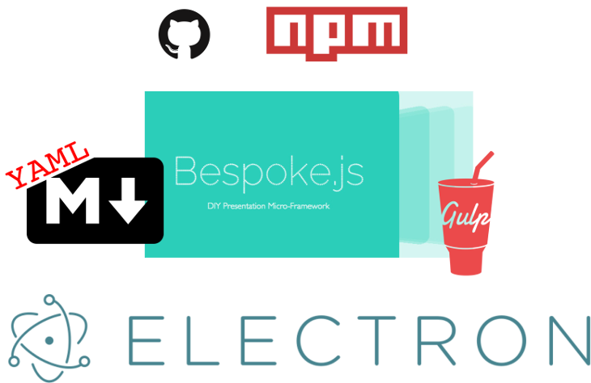

# @deck/app

Deck is a markdown driven content presentation system

[](http://standardjs.com/)

## Installing

```javascript
npm install -g @deck/app
```

On Node 0.10 (with npm 1):

```javascript
npm install -g deck-app
```

See <https://github.com/nearform/deck-app-unscoped> for how this scope polyfilling mechanism works

## CLI

```sh
deck <command> [arguments]
```

The `@deck/app` module acts as an entry point and CLI tool for deck.

To learn how to use the GUI (e.g. global hot keys) see <https://github.com/nearform/deck-gui>

### Commands

#### Create

A slide deck is a "content module": a folder with at least a
`package.json` and `deck.md` file.


```javascript
deck init
```

Analogous to `npm init`, the `deck init` command provisions
a folder with the files that make up a slide deck. 

#### Get Dependencies

```javascript
deck install
```

Much like `npm install` when run without options `deck install` will install dependencies for a slide deck (generally we would do this after a `deck init`)

#### Fetch

```javascript
deck install <slide deck name>
```

When a slide deck is specified, `deck` will use npm to download 
and install the content module. Unlike an npm install, the resulting
slide deck folder will placed in the current working directory instead
of a `node_modules` folder. Otherwise all other `npm` behaviours apply (e.g. will lookup from repo as per `npm config` etc.)

#### Present

```sh
deck present [<slide deck path>] [!]
```

When run in a slide deck folder, this will build a presentation from the `deck.md` file in the current folder then open `@deck/gui` for viewing and presenting. 

If a path to a slide deck is supplied it will likewise be presented.

A special syntax `deck present !` instructs `deck` to present the 
most recently installed content module. 

#### Edit

```sh
deck edit [<slide deck path>]
```

Opens a slide decks `deck.md` file in the default systen editor (as per the `$EDITOR` environment variable). If given a path the `deck.md` file at the supplied path will be opened, otherwise a `deck.md` in the current folder will be opened.

#### Upstream

```sh
deck upstream [<slide deck path>]
```

Creates a new branch on GitHub, pushes modified content and 
makes a pull request with the change. 

The slide deck does not need to be a git repository for `upstream`
to function - however Github keys are required (see https://github.com/nearform/deck-upstream)

If a path is not supplied, the current folder is assumed.

## Technologies

The deck system is built on and/or utilizes:

* [Electron](http://electron.atom.io)
* [Gulp](http://gulpjs.com/)
* [Bespoke.js](http://markdalgleish.com/projects/bespoke.js/)
* [Markdown](https://daringfireball.net/projects/markdown/)
* [YAML](http://yaml.org)
* [NPM](http://npmjs.org)
* [GitHub](http://github.com)



## Ecosystem

To view other pieces of the deck system see <https://github.com/nearform/deck>

## Issues and PR's

* Please open any issues for any deck related module on the <https://github.com/nearform/deck> community repo.
* Any module specific PR's are welcomed on the corresponding repo.

## Credits

Sponsored by <a href="http://nearform.com">nearForm</a>

### Contributors

  * David Mark Clements
  * Mihai Dima
  * Cristian Kiss

### Contributing

Deck is an **OPEN Open Source Project**. This means that:

> Individuals making significant and valuable contributions are given commit-access to a project to contribute as they see fit. A project is more like an open wiki than a standard guarded open source project.

See the [`CONTRIBUTING.md`](CONTRIBUTING.md) file for more details.

